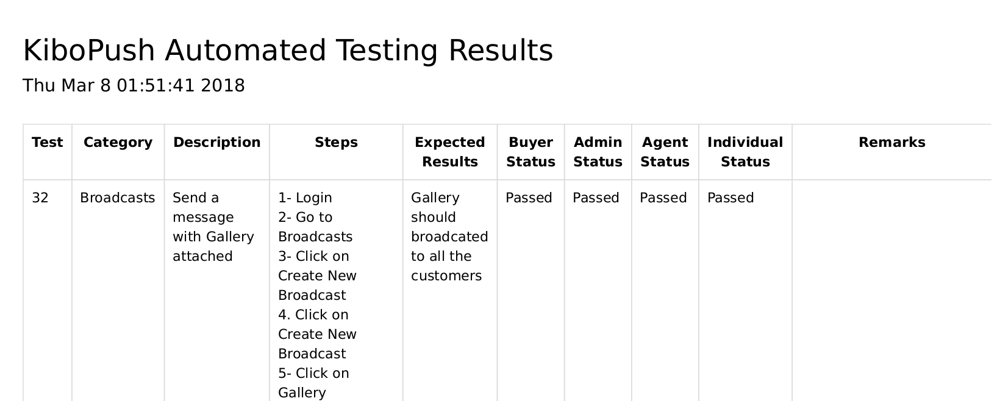
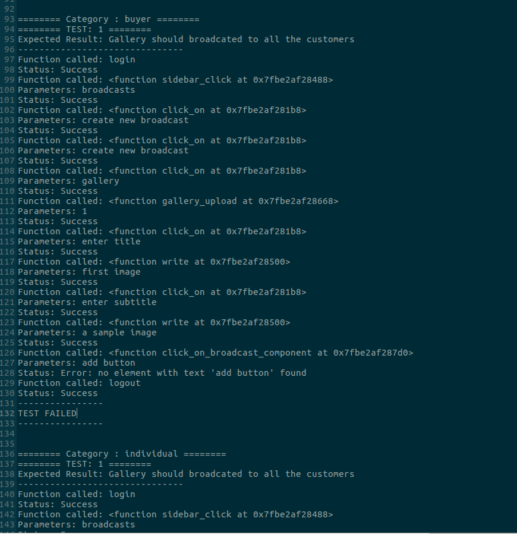

# KiboPush Automated Testing Tool

The Tool is aimed at regression testing for KiboPush.

## Usage

```
usage: test.py [-h] [-f] [-p] [-d]
               
               [-c [{
               user authentication,
               sidebar,
               facebook pages,
               broadcasts,
               subscribers,
               surveys,
               workflows,
               polls,
               settings,
               templates,
               analytics,
               navbar,
               live chat,
               main menu,
               auto-posting,
               membership,
               operational 
               dashboard}]
               
               [-u [{
               agent,
               admin,
               buyer,
               individual}]]

optional arguments:
  -h, --help            show this help message and exit
  -f, --failed          Runs only previously failed tests in Test Plan
  -p, --passed          Runs only previously passed tests in Test Plan
  -c, --categories      Specifies what categories to test on
  -u, --users           Specifies whatuser to test on
  -d, --debug           Runs the script in debug mode to try different
                        functions
```

The tool by default runs all the test cases present in the test plan, for all type of users.
It can be parametrized to restrict for e.g. only those test which were previously failing, by individual accounts.

## Working

The tool fetches the latest instant of the Test Plan from Google Sheet. From which it ascertains test cases to run.
It maps the language of the test cases to actions.
It maps actions onto functions.
It executes these functions in order, to mimick a near customized test script for each test case.

A pdf report for each test run is generated.


along with a detailed log





